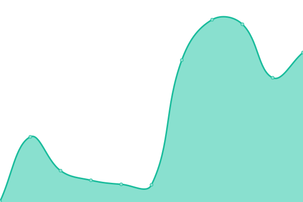
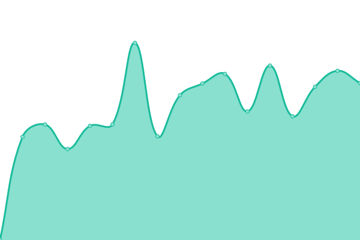
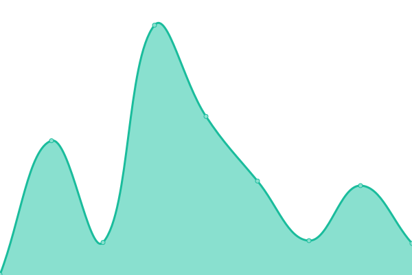
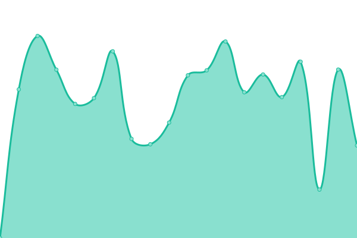
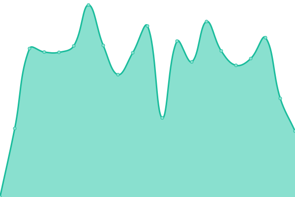
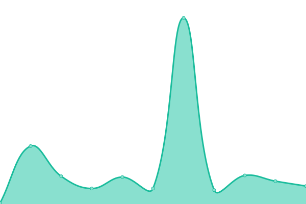

# [📈 Live Status](https://demo.upptime.js.org): <!--live status--> **🟩 All systems operational**

This repository contains the open-source uptime monitor and status page for [bittyb](https://demo.upptime.js.org), powered by [Upptime](https://github.com/upptime/upptime).

With [Upptime](https://upptime.js.org), you can get your own unlimited and free uptime monitor and status page, powered entirely by a GitHub repository. We use [Issues](https://github.com/bittybyte-au/site-monitoring/issues) as incident reports, [Actions](https://github.com/bittybyte-au/site-monitoring/actions) as uptime monitors, and [Pages](https://demo.upptime.js.org) for the status page.

<!--start: status pages-->
<!-- This summary is generated by Upptime (https://github.com/upptime/upptime) -->
<!-- Do not edit this manually, your changes will be overwritten -->
<!-- prettier-ignore -->
| URL | Status | History | Response Time | Uptime |
| --- | ------ | ------- | ------------- | ------ |
|  [Your Chief AI Officer](https://yourchiefaiofficer.ai) | 🟩 Up | [your-chief-ai-officer.yml](https://github.com/bittybyte-au/site-monitoring/commits/HEAD/history/your-chief-ai-officer.yml) | 

 1479ms
     
 | 

<a href="https://bittybyte-au.github.io/site-monitoring/history/your-chief-ai-officer">89.21%</a>
    

|  [evince Consulting](https://evince.com.au) | 🟩 Up | [evince-consulting.yml](https://github.com/bittybyte-au/site-monitoring/commits/HEAD/history/evince-consulting.yml) | 

 1378ms
     
 | 

<a href="https://bittybyte-au.github.io/site-monitoring/history/evince-consulting">90.70%</a>
    

|  [BittyByte](https://bittybyte.com.au) | 🟩 Up | [bitty-byte.yml](https://github.com/bittybyte-au/site-monitoring/commits/HEAD/history/bitty-byte.yml) | 

 8213ms
     
 | 

<a href="https://bittybyte-au.github.io/site-monitoring/history/bitty-byte">91.07%</a>
    

|  [Amit Singh](https://amits.com.au) | 🟩 Up | [amit-singh.yml](https://github.com/bittybyte-au/site-monitoring/commits/HEAD/history/amit-singh.yml) | 

 1602ms
     
 | 

<a href="https://bittybyte-au.github.io/site-monitoring/history/amit-singh">91.27%</a>
    

|  [BST Joinery](https://bstjoinery.com.au) | 🟩 Up | [bst-joinery.yml](https://github.com/bittybyte-au/site-monitoring/commits/HEAD/history/bst-joinery.yml) | 

 3747ms
     
 | 

<a href="https://bittybyte-au.github.io/site-monitoring/history/bst-joinery">91.89%</a>
    

|  [NextEra Bookkeeping](https://nexterabookkeeping.com.au) | 🟩 Up | [next-era-bookkeeping.yml](https://github.com/bittybyte-au/site-monitoring/commits/HEAD/history/next-era-bookkeeping.yml) | 

 2108ms
     
 | 

<a href="https://bittybyte-au.github.io/site-monitoring/history/next-era-bookkeeping">100.00%</a>
    

|  [Guided Growth](https://guidedgrowth.com.au) | 🟩 Up | [guided-growth.yml](https://github.com/bittybyte-au/site-monitoring/commits/HEAD/history/guided-growth.yml) | 

 6639ms
     
 | 

<a href="https://bittybyte-au.github.io/site-monitoring/history/guided-growth">91.42%</a>
    

|  [Talent Journey](https://talentjourney.com.au) | 🟩 Up | [talent-journey.yml](https://github.com/bittybyte-au/site-monitoring/commits/HEAD/history/talent-journey.yml) | 

 1386ms
     
 | 

<a href="https://bittybyte-au.github.io/site-monitoring/history/talent-journey">91.64%</a>
    

|  [Capital Lift Finance](https://capitallift.com.au) | 🟩 Up | [capital-lift-finance.yml](https://github.com/bittybyte-au/site-monitoring/commits/HEAD/history/capital-lift-finance.yml) | 

 1657ms
     
 | 

<a href="https://bittybyte-au.github.io/site-monitoring/history/capital-lift-finance">93.38%</a>
    

|  [Carmen Rossitto](https://carmenrossitto.com) | 🟩 Up | [carmen-rossitto.yml](https://github.com/bittybyte-au/site-monitoring/commits/HEAD/history/carmen-rossitto.yml) | 

 1177ms
     
 | 

<a href="https://bittybyte-au.github.io/site-monitoring/history/carmen-rossitto">94.04%</a>
    

|  [Moss & Tide Homes](https://mossandtide.com.au) | 🟩 Up | [moss-and-tide-homes.yml](https://github.com/bittybyte-au/site-monitoring/commits/HEAD/history/moss-and-tide-homes.yml) | 

 3545ms
     
 | 

<a href="https://bittybyte-au.github.io/site-monitoring/history/moss-and-tide-homes">93.66%</a>
    

|  [Mind & Heart Grief Counselling](https://mindandheartgriefcounselling.com.au) | 🟩 Up | [mind-and-heart-grief-counselling.yml](https://github.com/bittybyte-au/site-monitoring/commits/HEAD/history/mind-and-heart-grief-counselling.yml) | 

 1406ms
     
 | 

<a href="https://bittybyte-au.github.io/site-monitoring/history/mind-and-heart-grief-counselling">94.96%</a>
    

<!--end: status pages-->

[**Visit our status website →**](https://demo.upptime.js.org)

## 📄 License

- Powered by: [Upptime](https://github.com/upptime/upptime)
- Code: [MIT](./LICENSE) © [Anand Chowdhary](https://anandchowdhary.com), supported by [Pabio](https://pabio.com)
- Data in the `./history` directory: [Open Database License](https://opendatacommons.org/licenses/odbl/1-0/)
